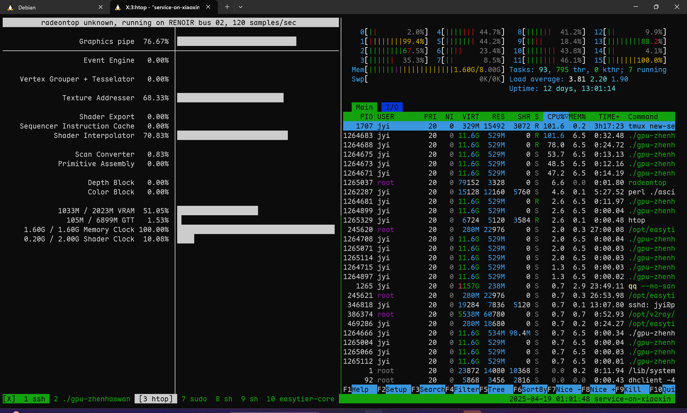

gpu-zhenhaowan
===============

Rust 写的 GPU 加速的终端看动画片工具！

哇，Rust 真是太好玩辣！

使用 [CubeCL](https://github.com/tracel-ai/cubecl)，把大概一半的算子挪到了集显上跑，这下改装成服务器的小笔记本剩下的最后一块硅片也被用起来了，可喜可贺，物有所值！

能跑 90 fps，真是太酷了！

~~等有空了把剩下的一半也搬上去，看看能不能直接不要 CPU 了~~

嘻嘻，大成功，现在只有解码、搬数据和写终端需要 CPU 了

